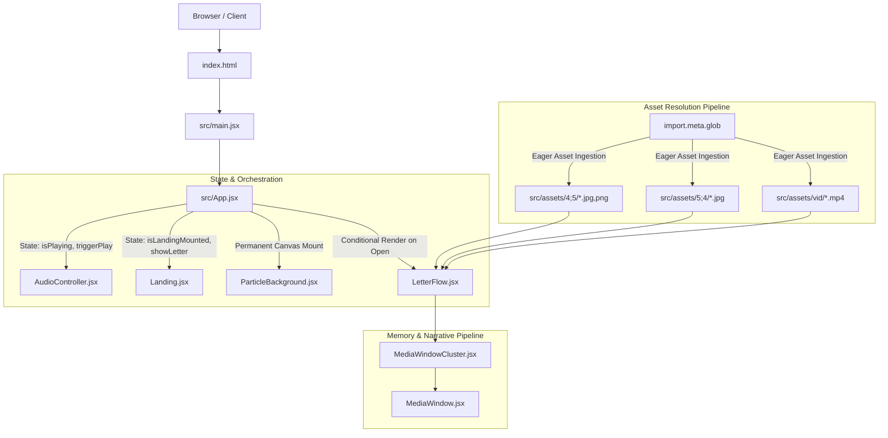
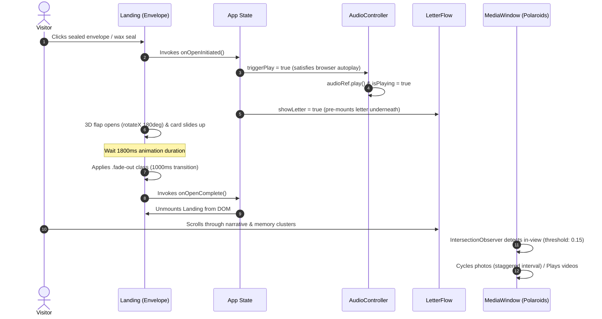

# Birthday Wish

An interactive, editorial digital celebration experience and memory gallery built with React 19, Vite, and custom CSS animations.

---

## Overview

**Birthday Wish** is a bespoke, story-driven web application designed to deliver an intimate, immersive birthday celebration experience. Rather than serving as a static photo gallery or plain greeting page, the application is engineered as a choreographed digital keepsake featuring a tactile 3D sealed envelope opening sequence, ambient canvas particle dynamics, synchronized background music playback, and an editorial memory timeline.

The project pairs a warm, tactile aesthetic—combining handwritten script, serif headlines, subtle paper textures, and scattered Polaroid frames—with performant front-end engineering, including dynamic asset ingestion via Vite glob imports, viewport-aware media lifecycle management via the `IntersectionObserver` API, and graceful accessibility fallbacks.

---

## Key Features

- **Interactive 3D Sealed Envelope Landing**:
  - CSS 3D-transformed envelope with a triangular flap fold, side gussets, bottom pocket, and golden wax seal.
  - User-gesture-triggered unsealing sequence: the wax seal dissolves, the top flap flips open in 3D perspective, and the greeting card slides upward before smoothly fading into the main letter experience.

- **Editorial Narrative & Memory Stream (`LetterFlow`)**:
  - A five-stage chronological narrative letter paired with bespoke typography and side-accent borders.
  - Alternating narrative paragraphs interspersed with clustered Polaroid memory windows.

- **Dynamic Polaroid Media Clusters (`MediaWindow` & `MediaWindowCluster`)**:
  - Support for multi-aspect-ratio Polaroids (portrait **4:5** and landscape **5:4**).
  - SVG decorative bow ribbon accents (available in blush and antique gold).
  - SVG fractal noise overlay creating a subtle physical paper card texture.
  - Stable pseudo-random rotational scatter (`-5°` to `+5°`) computed per cluster to simulate hand-placed photographs without layout shifts.

- **Viewport-Aware Media Carousel & Autoplay**:
  - Dynamically cycles through 50+ photos and short looping MP4 clips across discrete memory clusters.
  - Uses the `IntersectionObserver` API to pause cycling timers and HTML5 video playback when off-screen, conserving CPU/GPU cycles.
  - Staggered cycle intervals (2000ms–3000ms) to ensure multiple photo frames do not crossfade synchronously.

- **Browser-Compliant Ambient Audio System (`AudioController`)**:
  - Fixed-position floating audio controller with custom SVG speaker iconography.
  - Seamlessly initiates audio playback on the initial envelope click, adhering to strict browser Autoplay Policies.
  - Toggleable play/pause functionality with synchronized audio element state.

- **Interactive Canvas Particle Engine (`ParticleBackground`)**:
  - Hardware-accelerated 2D canvas background rendering drifting hearts and soft circles in blush and gold palette tones.
  - Viewport-responsive particle density calculation and wrap-around screen boundaries.

- **Accessibility & Motion Adaptation**:
  - Full `@media (prefers-reduced-motion: reduce)` support that disables canvas particle movement, cancels envelope rotations, disables image crossfading, and locks static media displays.
  - Fluid responsive typography and spacing scaled with CSS `clamp()`.

---

## Architecture Overview

The application is structured as a lightweight Single Page Application (SPA) leveraging React 19's component model and Vite's ESM build pipeline.



### Component Hierarchy & Responsibilities

1. **`App.jsx`**: Central state orchestrator. Manages landing page mounting lifecycles (`isLandingMounted`), main narrative revelation (`showLetter`), and audio playback activation (`triggerPlay`, `isPlaying`).
2. **`Landing.jsx`**: Manages the sealed envelope interactive animation sequence, timing timeouts for flap opening (1.8s) and container fade-out (2.8s), and triggers initial audio engagement.
3. **`AudioController.jsx`**: Encapsulates the HTML5 `<audio>` element and floating interactive button, handling interaction-driven `.play()` promises and mute state toggling.
4. **`ParticleBackground.jsx`**: Canvas-based particle animation manager handling screen resizing, particle pooling, drift mathematics, and reduced-motion fallbacks.
5. **`LetterFlow.jsx`**: Content coordinator. Ingests all media assets through Vite's `import.meta.glob`, maps narrative paragraphs to distinct media clusters, and displays the closing signature block.
6. **`MediaWindowCluster.jsx`**: Computes stable rotational transformations for child frames using React's `useMemo` hook and renders responsive grid containers.
7. **`MediaWindow.jsx`**: Individual Polaroid container. Implements `IntersectionObserver` visibility listeners, staggered timers, HTML5 video end-of-stream event handlers, and SVG decorative bows.

---

## Application Flow



---

## Content & Media Architecture

The media subsystem dynamically ingests memory assets at build time via Vite's ESM glob utility without requiring hardcoded static arrays or external database queries:

```javascript
// Dynamic eager asset ingestion in LetterFlow.jsx
const photos45Modules = import.meta.glob('../assets/4;5/*.{png,jpg,jpeg,PNG,JPG,JPEG}', { eager: true });
const photos54Modules = import.meta.glob('../assets/5;4/*.{png,jpg,jpeg,PNG,JPG,JPEG}', { eager: true });
const videosModules   = import.meta.glob('../assets/vid/*.{mp4,MP4}', { eager: true });

const photos45 = Object.values(photos45Modules).map(mod => mod.default || mod);
const photos54 = Object.values(photos54Modules).map(mod => mod.default || mod);
const videos   = Object.values(videosModules).map(mod => mod.default || mod);
```

### Media Distribution Map

The narrative is mapped into four distinct clusters placed between the letter paragraphs:

| Cluster | Placement | Ingested Assets | Aspect Ratio | Display Configuration |
| :--- | :--- | :--- | :---: | :--- |
| **Cluster 1** | After Paragraph 1 | Photos `0–5` & `6–11` | `4:5` | 2 Portrait Polaroids |
| **Cluster 2** | After Paragraph 2 | Videos `0–2`, Photos `12–15`, Photos `16–19`, Photos `5:4` | `4:5` & `5:4` | 3 Portrait Polaroids + 1 Wide Polaroid |
| **Cluster 3** | After Paragraph 3 | Photos `20–27`, Photos `28–35` | `4:5` | 2 Portrait Polaroids |
| **Cluster 4** | After Paragraph 4 | Videos `3–6`, Photos `36–41`, Photos `42–47`, Photos `48–52` | `4:5` | 4 Portrait Polaroids |

---

## Repository Structure

```text
birthday-wish/
├── .oxlintrc.json              # Oxlint linting configuration and rule definitions
├── index.html                  # HTML entry point, Google Fonts preconnects & metadata
├── package.json                # Project dependencies, scripts, and metadata
├── vite.config.js              # Vite bundler and React plugin configuration
├── public/
│   ├── favicon.svg             # Application browser favicon
│   └── icons.svg               # Static SVG icon sprite definitions
├── src/
│   ├── main.jsx                # Application root mounting & StrictMode wrapper
│   ├── App.jsx                 # Main state orchestrator and screen coordinator
│   ├── index.css               # Core design tokens, typography, and component styling
│   ├── components/
│   │   ├── Landing.jsx         # 3D interactive envelope & unsealing transition
│   │   ├── LetterFlow.jsx      # Narrative letter layout & cluster orchestrator
│   │   ├── MediaWindowCluster.jsx # Cluster container with random angle caching
│   │   ├── MediaWindow.jsx     # Polaroid frame with IntersectionObserver lifecycle
│   │   ├── AudioController.jsx # Background audio element & floating toggle button
│   │   └── ParticleBackground.jsx # HTML5 Canvas floating heart particle engine
│   └── assets/
│       ├── 4;5/                # Portrait memory photographs (4:5 ratio, 53 files)
│       ├── 5;4/                # Landscape memory photographs (5:4 ratio, 4 files)
│       ├── vid/                # Looping memory MP4 video clips (7 files)
│       ├── aud/                # Ambient background music ("Birthday-site.mp3")
│       └── text/               # Reference narrative prose text
└── LICENSE                     # Dual-licensing agreement (MIT code + proprietary media)
```

---

## Design System & Styling Architecture

The visual presentation is defined in [`src/index.css`](src/index.css) through a centralized design token system.

### Color Tokens

```css
:root {
  --bg-cream:           #FAF6F0; /* Warm background foundation */
  --bg-card:            #FFFFFF; /* Crisp card & Polaroid surface */
  --accent-blush:       #E8C5C8; /* Soft romantic accent */
  --accent-blush-dark:  #C38B90; /* Border and ribbon contour */
  --accent-gold:        #C5A059; /* Metallic wax seal & bow primary */
  --accent-gold-light:  #F4EAD4; /* Highlight glow tone */
  --accent-gold-dark:   #8C6A2E; /* Typography accent and bow shadow */
  --text-dark:          #4A3F35; /* Deep espresso primary text */
  --text-muted:         #7D6F64; /* Soft slate secondary copy */
}
```

### Typography Hierarchy

The typographic system utilizes three Google Fonts imported in [`index.html`](index.html):
- **Serif Headline (`Playfair Display`)**: Conveys classical elegance for main headings and quote callouts (`--font-serif`).
- **Calligraphic Script (`Alex Brush`)**: Employed for recipient name emphasis and personal sign-off signature (`--font-script`).
- **Handwritten Script (`Kalam`)**: Applied to narrative body paragraphs and personal messages (`--font-handwritten`).

### Material & Surface Effects

- **Polaroid Framing**: 14px internal padding, subtle box-shadows (`0 12px 24px rgba(74, 63, 53, 0.12)`), and an embedded SVG `fractalNoise` turbulence filter simulating physical grain.
- **Micro-Interactions**: Hover transformations (`scale(1.05) rotate(0deg)`) with smooth cubic bezier curves (`cubic-bezier(0.16, 1, 0.3, 1)`).
- **Responsive Sizing**: Sizing across viewports is calculated dynamically with CSS `clamp()`.

---

## Key Engineering Decisions

1. **User-Interaction-Driven Audio Unlock**: Modern web browsers prohibit unmuted programmatic audio playback without direct user gestures. Triggering `audioRef.current.play()` on the envelope click action guarantees seamless playback initiation without blocking or unhandled promise rejections.
2. **Pre-Mounting Main Content Under Landing Screen**: When the envelope unseals, `LetterFlow` is mounted immediately (`showLetter = true`) behind the transparent, fading landing container. This eliminates layout-shift latency and allows background images to decode before the user begins scrolling.
3. **Memoized Random Transformations**: Generating random rotational angles (`Math.random()`) during render cycles causes flickering on state changes. Angles are calculated once using `useMemo` keyed on cluster size, preserving stable visual scatter.
4. **Lifecycle-Aware Media Playback**: Using `IntersectionObserver` with a `15%` visibility threshold ensures that background tabs and scrolled-past video elements do not consume hardware decode resources.
5. **Eager Dynamic Glob Imports**: Utilizing Vite's `import.meta.glob(..., { eager: true })` enables local folder expansion during build time, facilitating zero-config additions of new photos and video clips.

---

## Tech Stack

- **Framework**: [React 19](https://react.dev/) (`react`, `react-dom`)
- **Build Tooling & Bundler**: [Vite 8](https://vite.dev/) (`@vitejs/plugin-react`)
- **Styling**: Vanilla CSS3 with Custom Properties, CSS Grid, 3D Transforms, and SVG Filters
- **Linter**: [Oxlint](https://oxc.rs/docs/guide/usage/linter.html) (`oxlint`)
- **Asset Pipeline**: Vite ESM Dynamic Glob Ingestion
- **Fonts**: Google Fonts (`Playfair Display`, `Alex Brush`, `Kalam`)

---

## Local Development

### Prerequisites

- [Node.js](https://nodejs.org/) (version `18.0.0` or later recommended)
- [npm](https://www.npmjs.com/) (version `9.0.0` or later)

### Setup Instructions

1. **Clone the Repository**:
   ```bash
   git clone https://github.com/vaibhv19/birthday-wish.git
   cd birthday-wish
   ```

2. **Install Dependencies**:
   ```bash
   npm install
   ```

3. **Start the Development Server**:
   ```bash
   npm run dev
   ```
   Open `http://localhost:5173` in your browser.

4. **Lint the Codebase**:
   ```bash
   npm run lint
   ```

5. **Build for Production**:
   ```bash
   npm run build
   ```
   The compiled static bundle will be output to the `dist/` directory.

6. **Preview Production Build Locally**:
   ```bash
   npm run preview
   ```

---

## Deployment

The application compiles into standard static assets (HTML, CSS, JS, and optimized media chunks) compatible with any static hosting platform (e.g., [Vercel](https://vercel.com/), [Netlify](https://www.netlify.com/), [GitHub Pages](https://pages.github.com/)).

### Vercel Deployment

1. Connect the GitHub repository to your Vercel dashboard.
2. Configure build settings:
   - **Framework Preset**: `Vite`
   - **Build Command**: `npm run build`
   - **Output Directory**: `dist`
   - **Install Command**: `npm install`
3. Deploy.

---

## Content Maintenance Guide

### Modifying Narrative Letter Copy

The letter paragraphs and closing signature are defined in [`src/components/LetterFlow.jsx`](src/components/LetterFlow.jsx):

```javascript
// Update paragraph text array
const paragraphs = [
  "Paragraph 1 text...",
  "Paragraph 2 text...",
  // ...
];
```

### Adding or Replacing Photos & Videos

1. **Portrait Photos (4:5)**: Place `.jpg` or `.png` images into [`src/assets/4;5/`](src/assets/4;5/). Vite will automatically detect and include them in the cluster slice mappings.
2. **Landscape Photos (5:4)**: Place `.jpg` or `.png` images into [`src/assets/5;4/`](src/assets/5;4/).
3. **Video Clips**: Place `.mp4` files into [`src/assets/vid/`](src/assets/vid/).
4. **Background Music**: Replace [`src/assets/aud/Birthday-site.mp3`](src/assets/aud/Birthday-site.mp3) with an audio file of your choice.

---

## License

This repository uses a **Split Licensing Model**:

- **Software & Application Code**: Licensed under the **[MIT License](LICENSE)** (Permits reuse of components, CSS design system, and build configuration).
- **Personal Assets & Content**: **All Rights Reserved** (Photographs, video recordings, audio tracks, written personal letters, and personal likenesses remain the private, copyrighted property of their respective creators and may not be reproduced or redistributed without explicit permission).

For full details, please refer to the [`LICENSE`](LICENSE) file.
